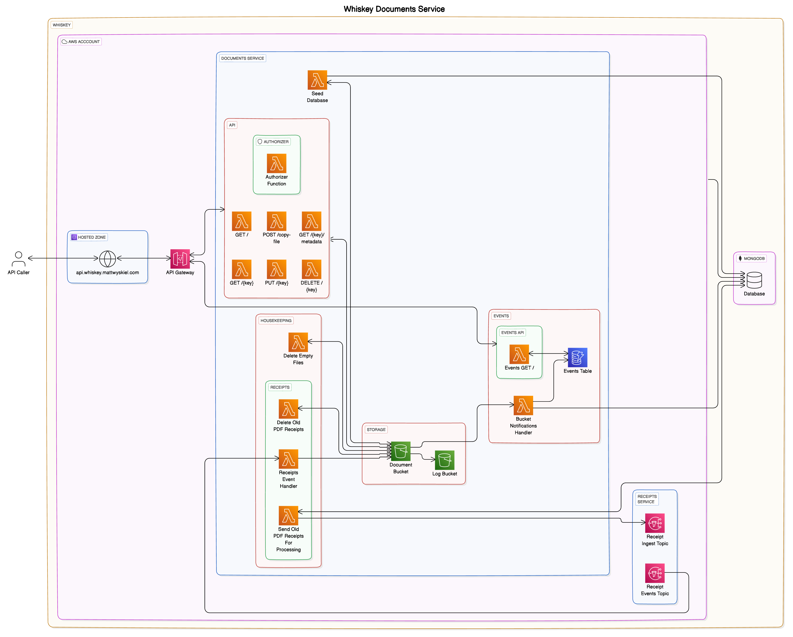

# Whiskey Documents

[Whiskey](https://github.com/whiskey-platform) is an event-based personal automation system. In
large part, this means that I want my documents to be stored in a place that can be influenced and
acted upon automatically via events.

> I've temporarily moved my documents away from this solution and over to OneDrive. However, this is
> a great insight into how I envision being able to act on my Documents automatically and based on
> events

## Architecture

## Stack

- Amazon S3 - Document Storage
- MongoDB (Atlas) - Database
- Amazon SNS, Amazon DynamoDB - Event handling
- AWS Lambda (Node.js) - Backend Logic
- Amazon API Gateway - API Infrastructure
- SST v2 (based on AWS CDK) - Infrastructure-as-Code
